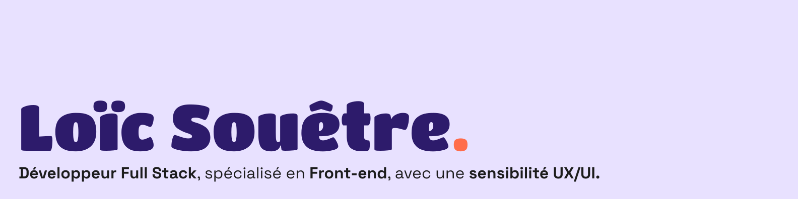
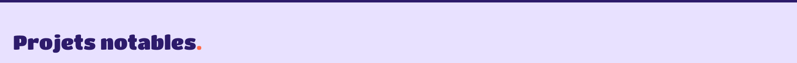
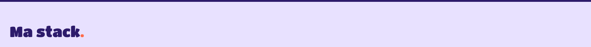
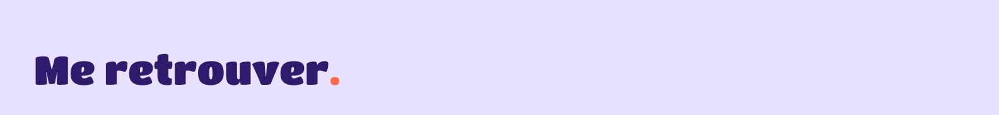
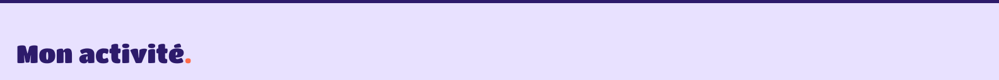

<strong>Hey, moi c'est Loïc !</strong>

Venu du web par la communication numérique, j'aime comprendre l'intention derrière un produit autant que le code qui le fait tourner. Cette double lecture, utilisateur et technique, donne du sens à mon travail au quotidien.

En deux ans, j’ai conçu des outils de gestion, des plateformes, des apps, seul ou en équipe. Le fil conducteur : faire que ce soit agréable à utiliser autant qu’à lire dans le code.

  

| Projet | Stack | Description | Type |
|--------|-------|-------------|------|
| [CRM binōm](https://github.com/LoicStr/crm-binom) |     | Outil complet de management pour agence : clients, kanban, devis, factures, documents | Personnel |
| Maestroo|      | Plateforme de mise en relation entre professeurs et élèves de musique pour planifier des cours |École (PFE)
| Portail web |      | Portail sécurisé permettant aux clients de déposer des documents et de suivre l'avancement de leurs missions | Alternance |
|[Breasy](https://github.com/LoicStr/breasy) |    | Application réalisée en équipe lors d'un hackathon (2024), publiée sur [Awwwards](https://www.awwwards.com/sites/breasy). [Voir le résultat](https://loicstr.github.io/breasy/) | École |

  

<strong>Front-end</strong> 

<strong>Back-end</strong> 

<strong>Autres outils</strong> 

  

  

Ouvert aux opportunités, CDI ou missions freelance.

  

